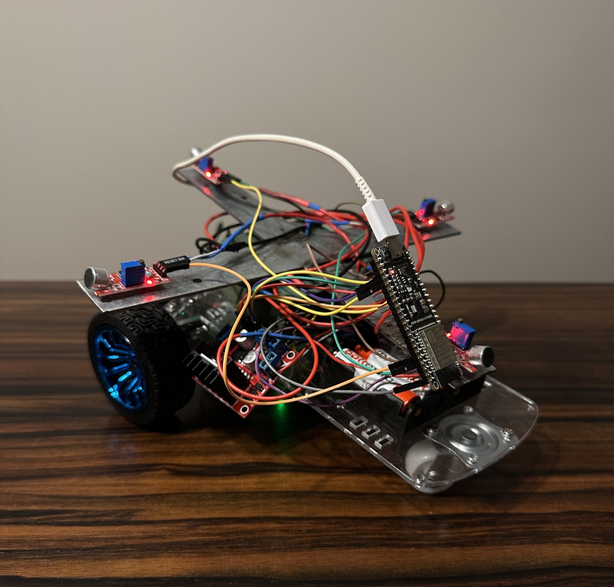
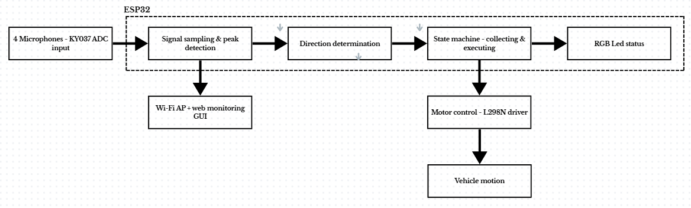
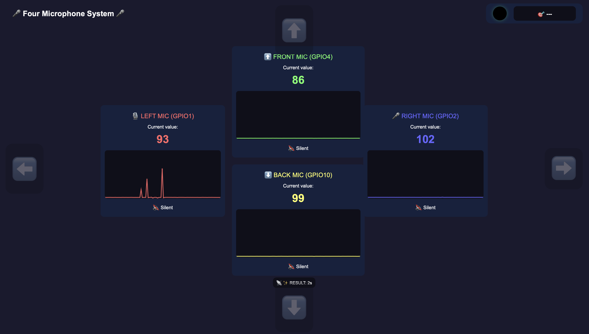
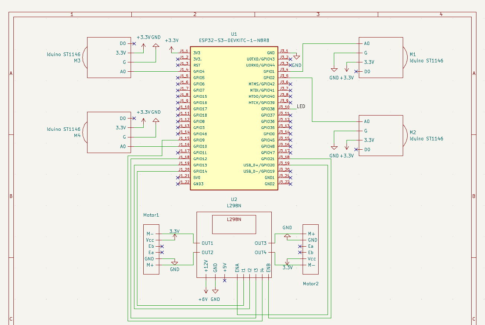

# 🎤 Autonomous Car Controlled by the Direction of the Sound

An ESP32-S3 powered rover that **listens** for a sound, figures out which direction it came from, and drives toward it — all while streaming a live dashboard over its own Wi-Fi access point. No app, no remote, no internet connection required: open a browser, point it at `192.168.4.1`, and watch the car think.

Built for the *Electrical Drives* course at **Poznań University of Technology**, Faculty of Control, Robotics and Electrical Engineering.



---

## How it works

Four microphones are arranged in a cross (left / right / front / back) around the chassis. The ESP32-S3 samples all four analog signals, tracks which one peaks the highest, and infers the direction the sound came from. A finite-state machine then turns that decision into motion:

```
LISTEN (5s)  →  DECIDE  →  MOVE (0.6–3s)  →  SHOW RESULT (2s)  →  repeat
```

| State | Duration | What happens |
|---|---|---|
| **COLLECTING** | 5 s | All 4 mics are sampled; peak amplitude per channel is stored |
| **EXECUTING**  | 3 s (straight) / 0.6 s turn + 3 s straight | The winning direction is converted into a motor command |
| **SHOWING**     | 2 s | Result and RGB LED colour are shown if no valid direction was found |

A full listen → decide → move → show cycle takes roughly 8–10 seconds.



## Live web dashboard

The ESP32 hosts its own Wi-Fi access point and web server — no router or internet needed. The dashboard streams all four microphone signals as live graphs, lights up an arrow for the winning direction, mirrors the physical RGB LED colour, and shows the current state (`COLLECTING` / `EXECUTING` / `SHOWING`) in real time, polling a JSON endpoint every 100 ms.



## Hardware

| Component | Role |
|---|---|
| **ESP32-S3-DevKitC-1 (N8R8)** | Main controller — ADC sampling, direction logic, Wi-Fi + web server |
| **4× KY-037 microphone modules** | Sound sensing (left, right, front, back) |
| **L298N dual H-bridge** | Drives two DC motors from the battery pack |
| **2× JGA25-370 DC gear motors w/ encoder** | Drivetrain (differential steering) |
| **WS2812 RGB LED** | Visual feedback — LED colour matches detected direction |
| **4× AA battery pack (6 V)** | Power for the motor stage |

Full schematics (KY-037 conditioning circuit, L298N wiring, and the complete KiCad system diagram) are in [`docs/images`](docs/images) and in the [project report](docs/report/Autonomous_car_report.pdf).

<p align="center">
  
</p>

## Firmware

Two Arduino sketches live in [`firmware/`](firmware):

- **[`AUTKO_SOUND`](firmware/AUTKO_SOUND/AUTKO_SOUND.ino)** — the main project. Reads the four microphones, runs the direction-detection state machine, drives the motors automatically, and serves the live dashboard.
- **[`AUTKO_WIFI`](firmware/AUTKO_WIFI/AUTKO_WIFI.ino)** — a standalone Wi-Fi remote-control sketch for the same chassis (manual D-pad web UI), used during development and as a fallback control mode.

Core direction-detection logic:

```cpp
String getDirectionFromMax() {
  if (maxValues[0] > SOUND_THRESHOLD && maxValues[0] > maxValues[1] &&
      maxValues[0] > maxValues[2] && maxValues[0] > maxValues[3])
    return "left";
  else if (maxValues[1] > SOUND_THRESHOLD && maxValues[1] > maxValues[0] &&
           maxValues[1] > maxValues[2] && maxValues[1] > maxValues[3])
    return "right";
  else if (maxValues[2] > SOUND_THRESHOLD) return "up";     // front
  else if (maxValues[3] > SOUND_THRESHOLD) return "down";   // back
  return "none";
}
```

**Dependencies (Arduino Library Manager):** `Adafruit NeoPixel`, `WiFi` and `WebServer` (bundled with the ESP32 board package).

**Board:** ESP32S3 Dev Module, targeting the ESP32-S3-DevKitC-1 (N8R8).

### Flashing

1. Install the [ESP32 board package](https://github.com/espressif/arduino-esp32) in the Arduino IDE.
2. Open [`firmware/AUTKO_SOUND/AUTKO_SOUND.ino`](firmware/AUTKO_SOUND/AUTKO_SOUND.ino).
3. Select **ESP32S3 Dev Module**, pick the correct port, upload.
4. Connect to the Wi-Fi network `ESP32_Microfon` (password `12345678`) and open `http://192.168.4.1`.

## Results

- **Direction detection accuracy:** ~90% under test conditions (blowing / whistling into a mic).
- **Response latency:** ~3–5 s from sound to motion start.
- **Effective range:** ~0.5–1 m.
- The 5-second collection window filters out transient background noise so the car only reacts to sustained, directional sound.

Full methodology, circuit measurements, and PWM/RPM motor characterisation are in the [project report](docs/report/Autonomous_car_report.pdf).

## Lessons learned

The KY-037 module has no automatic gain control, so it reliably detects loud transient sounds (blowing, whistling, clapping) but not normal speech. The architecture is otherwise voice-ready — swapping in **MAX9814** microphone modules (which include AGC) would unlock real voice-controlled navigation without any firmware changes to the state machine or direction logic.

Other takeaways:
- A timed state machine (collect → decide → move → show) eliminated the false triggers that a continuously-listening system produced.
- The L298N's 5 V logic and the ESP32-S3's 3.3 V logic share a common ground safely, but a level shifter would make that connection more robust.
- A 9 V supply would give the drivetrain more headroom than the 4×AA (6 V) pack used here.

## Repository structure

```
.
├── firmware/
│   ├── AUTKO_SOUND/AUTKO_SOUND.ino   # main sound-localisation firmware
│   └── AUTKO_WIFI/AUTKO_WIFI.ino     # manual Wi-Fi remote-control firmware
├── docs/
│   ├── images/                       # schematics, dashboard & vehicle photos
│   └── report/                       # full project report (PDF)
└── README.md
```

## Author

**Oskar Jabłonowski** — Automatic Control and Robotics, Poznań University of Technology
Supervisor: Ph.D. Bartłomiej Wicher

## License

[MIT](LICENSE)
